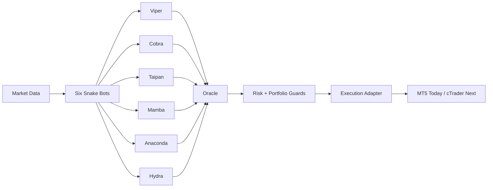

<div align="center">

# Ouroboros Snake Strategy

Glitch's flagship multi-bot ensemble, combining Oracle coordination with the six-snake execution stack.


[](https://github.com/glitch-executor/glitch-trading-core)
[](https://github.com/glitch-executor/glitch-ouroboros-snake-strategy)
[](https://github.com/glitch-executor/glitch-indian-king-cobra)
[](https://github.com/glitch-executor/glitch-terciopelo)

</div>

## Repo Role

Ouroboros Snake Strategy is the flagship coordinated Glitch ensemble.

It combines:

- `oracle.py` as the coordination and conflict-resolution layer
- `viper.py`
- `cobra.py`
- `taipan.py`
- `mamba.py`
- `anaconda.py`
- `hydra.py`

## Part Of The Glitch Ecosystem

It sits alongside:

- [Glitch Trading Core](https://github.com/glitch-executor/glitch-trading-core) as the umbrella architecture repo
- [Indian King Cobra](https://github.com/glitch-executor/glitch-indian-king-cobra) as the standalone unified momentum scalper
- [Terciopelo](https://github.com/glitch-executor/glitch-terciopelo) as the standalone equities relative-value strategy

## Why It Exists

Ouroboros is the public-facing strategy identity for the main Glitch ensemble.

The goal is to keep:

- six complementary execution styles
- one coordinated portfolio brain
- reusable risk controls
- broker-portable architecture over time

## System At A Glance



## Repo Layout

```text
glitch-ouroboros-snake-strategy/
|-- mt5/
|   |-- bots/
|   |-- shared/
|   `-- configs/
|-- ctrader/
|   `-- README.md
`-- docs/
```

## Bot Roles

| Bot | Style | TF | Role |
| --- | --- | --- | --- |
| `viper.py` | momentum + pullback | M5 | fast directional execution |
| `cobra.py` | structure + price action | H1 | higher-conviction structure logic |
| `taipan.py` | session breakout | M30 | expansion capture |
| `mamba.py` | mean reversion | M15 | range balance |
| `anaconda.py` | breakout confirmation | H4 | slower structural continuation |
| `hydra.py` | regime routing | M1 | adaptive tactical layer |
| `oracle.py` | coordination | multi-bot | portfolio governor |

## Public Repo Safety

- only sanitized example configs are included
- no live credentials, state, models, logs, or training data are committed
- secrets should live outside Git

## Documentation

- [Architecture](./docs/architecture.md)
- [Operating Model](./docs/operating-model.md)
- [Platforms](./docs/platforms.md)
- [MT5 Track](./mt5/README.md)
- [cTrader Track](./ctrader/README.md)

## License

Released under [Apache 2.0](./LICENSE) with attribution preserved through [NOTICE](./NOTICE).
